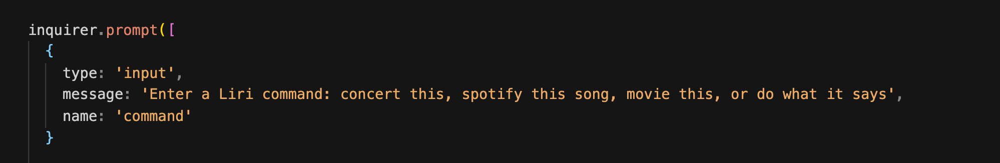
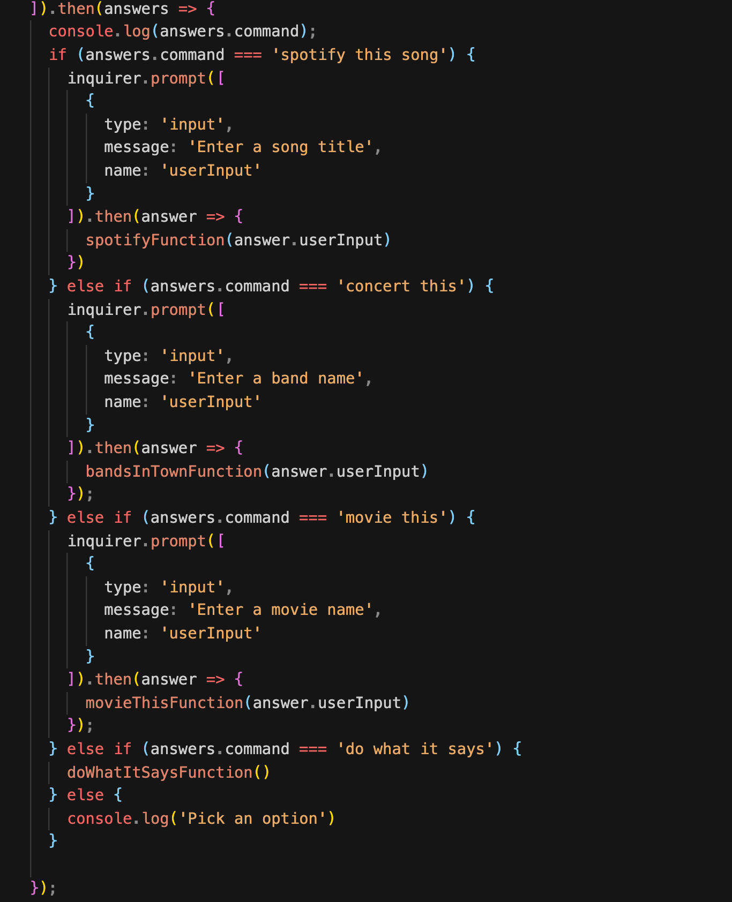

# Liri Node App with Inquirer

### Link to Screen Recording
[Liri Bot](https://drive.google.com/file/d/1P6sKpfYmy-drWPsKsUEPGUgl9p2xan-A/view?usp=sharing)

### What is LIRI
LIRI is like iPhone's SIRI. However, while SIRI is a Speech Interpretation and Recognition Interface, LIRI is a Language Interpretation and Recognition Interface. LIRI is a command line node app that takes in parameters and gives you back data.

## Technolgies Used:
* JavaScript
* Node.js
* Axios
* Inquirer
* Spotify API
* OMDB API
* Bands in Town API
* Moment.js

### LIRI Commands

1. Spotify this song
* After the user enters the 'spotify this song' command they are promted for a song title. 
* LIRI then searches the Spotify API and returns the top results for the song title entered.
* The search is also added to the log text file.

2. Concert This
* After the user enters the 'concert this' command they are promted for a band name.
* LIRI then searches the Bands In Town API and returns the top results for concert dates.
* The search is also added to the log text file.

3. Movie This
* After the user enters the 'movie this' command they promted for a movie name.
* LIRI then searches the OMDB API and returns movie data for that movie.
* The search is also added to the log text file.

4. Do What it Says
* After the user enters the 'do what it says' command LIRI automatically searches the Spotify API for the song title "I Want it that Way".
* The search is also added to the log text file.

### Inquirer Code Sample

This is a sample of the inquirer code used to get the user input and run the command entered.

